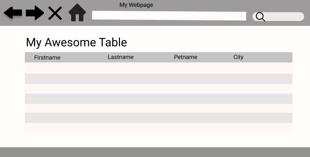

### Mockup5
-   Front End Web Development program provided by Vets In Tech organization, Galvanize instructors, and sponsored by Draft Kings.
-   Program activities for HTML, CSS, and Javascript conducted 7pm - 9pm MDT started July 27, 2020 until August 21, 2020

### User Story 
1. 'Customer' requested that they enjoy mockup5.jpg and to have the design ready within a few days. 

### Technologies Used
1. Zoom and Slack for communication with course during remote learning 7pm to 9pm MDT.
2. Git version control through command line and GitHub repo.
3. HTML, CSS, Javascript
4. [Figma](Figma.com) to create a copy of the mockup5 to ensure that I understand the containers involved.

### Lessons Learned
1. My goal is to provide HTML, CSS and I'm allowed to use library Bootstrap as a deliverable by Monday August 3, 2020 for the customer to review.
1. Purpose for this project is to provide a better user experience client-side interface 
1. The problem I'm solving is blend my understanding of front-end to my back-end education.

### My Driving Force
“Success is the progressive realization of a worthy ideal.” Earl Nightingale

[Back to README](README.md)